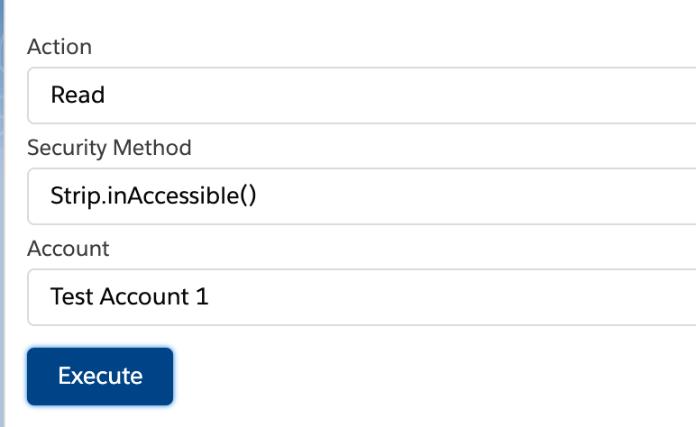
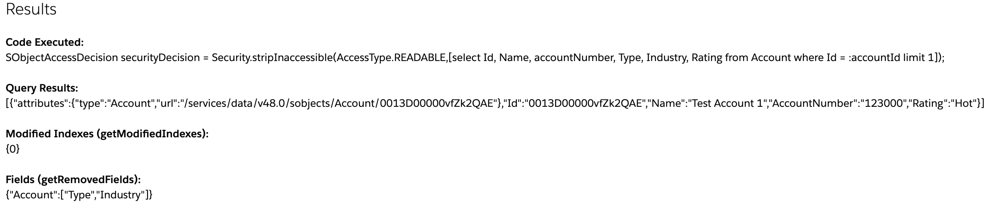

# Apex Security Enhancements

This repository is an example of two new Apex security enhancements that went GA in the Spring '20 release. They are WITH SECURITY_ENFORCED and Strip.inAccessible.

For more information about methods, check out this [blog post](#).

## Setup

1. Execute orgInit.sh script.

## To Demo

* Navigate to the Apex Security Enhancement Page. 
* Select the action method you'd like to use (e.g. read, create). 
* You'll then be prompted to select the security function. All option are able to select Strip.inAccessible. Read operation will also have the option to use WITH SECURITY_ENFORCED
* If you select the read action, you'll have be required to select an account. If no accounts display, create one in the org.
* If you select the create action, a section will display to enter in Account fields. Populate those fields. 
* Click Execute. 

At the bottom, you'll see the the code that was executed, the resulting data, and for Strip.inAccessible, the if any records has fields stripped and which fields they were. 

Next repeat this same process and remove read/edit capabilities for the user's profile for the fields being queried/edited on the account. You'll then notice the behaviors 

